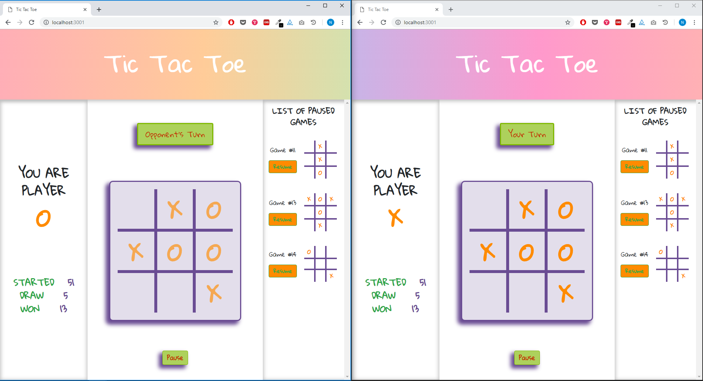

# Project Tic Tac Toe Game

This project is a Tic Tac Toe Game built on NodeJs, ExpressJS and Socket.io, with a connection to a MongoDB DataBase.

## Getting Started

These instructions will get you a copy of the project up and running on your local machine. Make sure that you have [Node.js](http://nodejs.org/) and [MongoDB](https://www.mongodb.com/es) installed.

```
https://github.com/NathaEEUD/Project-TicTacToe.git
cd Project-TicTacToe/
npm install
npm start
```

> The project will running on http://localhost:3001/



## How to Play

The goal of Tic Tac Toe Game is to be the first player to get three in a row on a 3 x 3 grid.

- The game starts when there are two players connected.
- If you connected first, you will be the player X.
- The player X always goes first.
- Players alternate placing Xs and Os on the board until either one player has three in a row, horizontally, vertically, or diagonally; or all nine squares are filled.
- If a player is able to draw three of their Xs or three of their Os in a row, then that player wins.
- If all nine squares are filled and neither player has three in a row, the game is a draw.
- Any player can pause the game at any time keeping in mind that there must be at least one movement on the board.
- Any player can resume a game from the List of Paused Games.

### Tweet
[amo #javascript](https://twitter.com/Nathaone/status/1098797471474638848)
